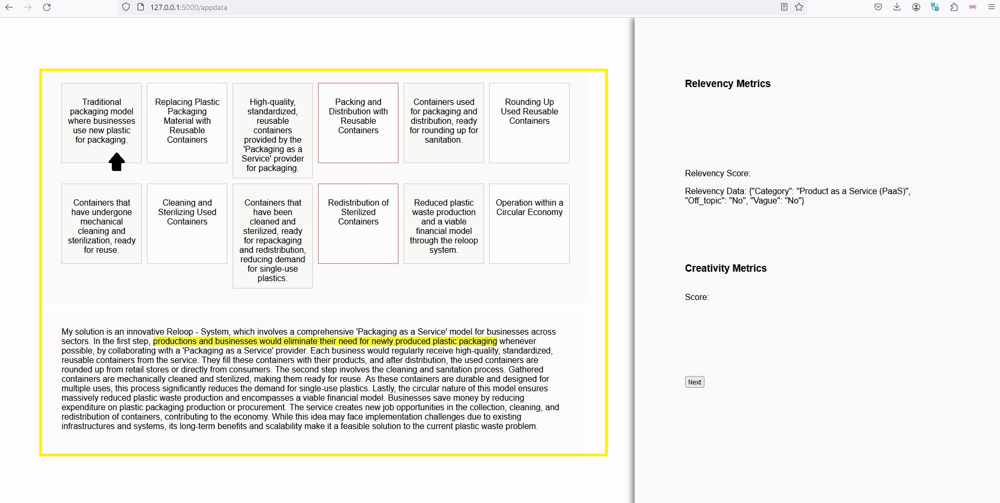

# Mr.Business #

## Overview
This repository contains a collection of files for a web-based dashboard project, utilizing Flask for the backend, with a focus on NLP (Natural Language Processing) for identifying promising business ideas. The project is designed to provide an interactive user interface for the review of business ideas, offering insights into their relevance and potential.

[[Video Demo]](https://drive.google.com/file/d/12en4omKiMv0eCcQBiimaLor0ACY2c0WW/view?usp=sharing)


## Installation

Follow these steps to get the project up and running on your local machine:

1. **Clone the repository**: First, you need to clone the repository to your local machine. You can do this by running the following command in your terminal:

    ```bash
    git clone https://github.com/graham-livingston/aiEarthHack
    ```

2. **Navigate to the project directory**: Use the following command to navigate into the cloned repository:

    ```bash
    cd aiEarthHack
    ```

3. **Create a virtual environment (optional)**: It's recommended to create a virtual environment to keep the project's dependencies isolated from your system. You can do this by running:

    ```bash
    python3 -m venv env
    ```

    And activate the environment:

    On Windows:

    ```bash
    env\Scripts\activate
    ```

    On Unix or MacOS:

    ```bash
    source env/bin/activate
    ```

4. **Install the required packages**: This project requires certain Python packages to run. You can install these by running the following command:

    ```bash
    pip install -r requirements.txt
    ```

5. **Set up the environment variables**: This project uses environment variables stored in a `.env` file. Make sure to fill in this file with your own values. Specifically, you need to replace the placeholder value for the OpenAI API key with your actual key.

    ```bash
    openai_key='Your_API_KEY_HERE'
    ```

6. **Run the Flask application**: Finally, you can start the Flask application by running the following command:

    ```bash
    flask run
    ```

    This will start the Flask server, and you should be able to access the application by navigating to `http://localhost:5000` in your web browser.

## Dashboard Views

In this section, we will describe the different parts of the dashboard.

### Resource Map

#### Resource and Process Flow Map


Inspired by the concept of Newell's GPS, this mapping provides a clear, visual representation of how resources are managed and transformed within the business proposal, making it easier to understand the interdependencies and flow of activities in the business model.

#### Resource States and Citations



Featured in the Grey rectangles are distinct stages a resource goes through during its lifecycle within the business model. Each state is identified by a detailed description, with a direct citation from the business idea text whenever it is not inferred.

Accurate references to the parts of the original text that describe each resource state are highlighed in the proposal text, ensuring that the map is grounded in the actual business idea.

#### Processes and Questions


Processes are the transformative actions or activities that change a resource from one state to another. Each process  is featured in the space between the resources it effects. On mouse hover, details including a description, along with specific details about "who" (the actors involved), "what" (the nature of the process), "where" (the location of the process), and "how" (the method or mechanism of the process) appear.

If the process is higlighted in red, that means there are missing citations from the original proposal text as to "who", "what", "where" or "how" the process is inacted. On clicking the box, a popup with a generated question that if answered would provide that citation is presented.


### Relevancy Check


Featured in the Baige square, the relevancy metrics help quickly review the relevancy of the solution. This metrics are produced through prompting chatGPT with the following two steps:

1. **Identify the type of circular business**: Determine which category the solution falls into based on the criteria provided below.
2. **Assess the solution's relevance and clarity**: Determine whether the solution is off-topic or too vague. Provide a simple "Yes" or "No" response for this part.

The criteria for defining the types of circular business we use are as follows:

- **Extension of Product Lifespan**
Solutions that propose ways to make products last longer through maintenance, repair, and refurbishment.

- **Resource Efficiency**
Solutions that reduce resource input, waste, and emissions throughout the production and consumption process.

- **Waste Minimization**
Solutions that transform waste streams into valuable resources, either through recycling, upcycling, or by serving as input for another process.

- **Design for the Future**
Solutions that involve designing products with the end of their life in mind, ensuring that they can be disassembled, repaired, or recycled.

- **Circular Supply Chains**
Solutions that replace the traditional linear ‘take-make-dispose’ model with circular supply chains that recover and regenerate products and materials.

- **Product as a Service (PaaS)**
Solutions that shift the model from product ownership to access and services, such as sharing platforms and product leasing.

- **Regeneration of Natural Systems**
Solutions that enhance natural capital by returning valuable nutrients to the environment to support regeneration, such as composting.

- **Sharing Platforms**
Solutions that create platforms for sharing goods and services, thus reducing the overall need for production.

- **Others**
Any solutions that can’t be generalized into the categories above but satisfy the idea to involve sharing, leasing, reusing, repairing, refurbishing, and recycling existing materials and products as long as possible.


## File Descriptions

flask_session/: This directory likely contains session-related data for users interacting with the Flask application.

templates/: Holds HTML templates for the Flask application. The templates define the structure and layout of the web pages displayed to the users.

.env: A dotenv file for setting environment variables that the Flask application uses, such as database URLs, secret keys, etc. This file was updated recently to include dashboard configurations.

NLP_Model.ipynb: A Jupyter notebook containing the methodology for the NLP model used to identify promising business ideas. It includes the model's code, comments, and possibly visualization of the data and results.

README.md: This file provides an overview and documentation for the repository. 

app.py: The main Flask application file. It includes the routes and views for the platform.

clean.py: A Python script that was added to the repository early on. Its purpose is likely for data cleaning operations.

cleandata.csv: A CSV file containing data that has been cleaned, presumably for use in the application or NLP model.

data.csv: The original dataset file. It might be the raw data that goes through the cleaning process.

functions.py: Contains Python functions that support the dashboard functionality. These might include helper functions, data processing functions, etc.

prompt.py: A Python file related to the dashboard, possibly handling the creation and management of prompts within the application.

requirements.txt: Lists all the Python dependencies needed for the project. This file is crucial for setting up the project environment.

test.json: A JSON file that may include test data or configurations for the dashboard.

testing.ipynb: A Jupyter notebook for testing different components of the project, such as data processing, model performance, etc.
